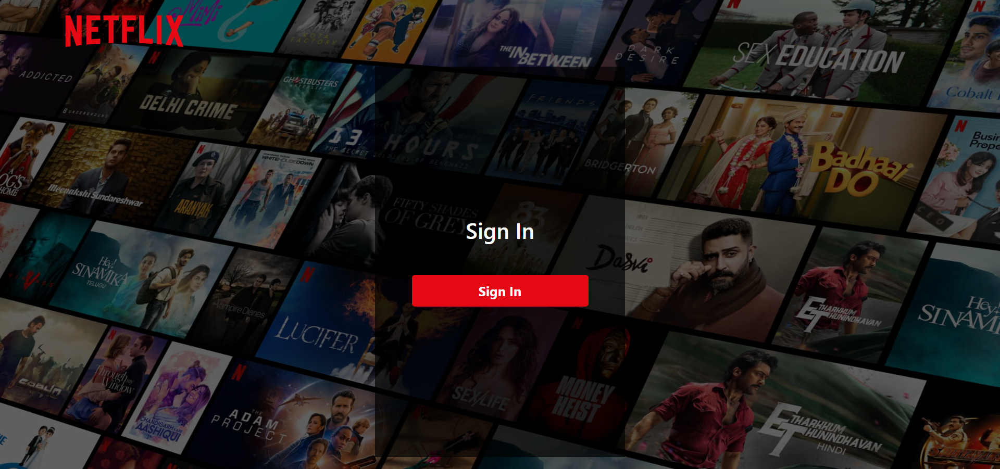
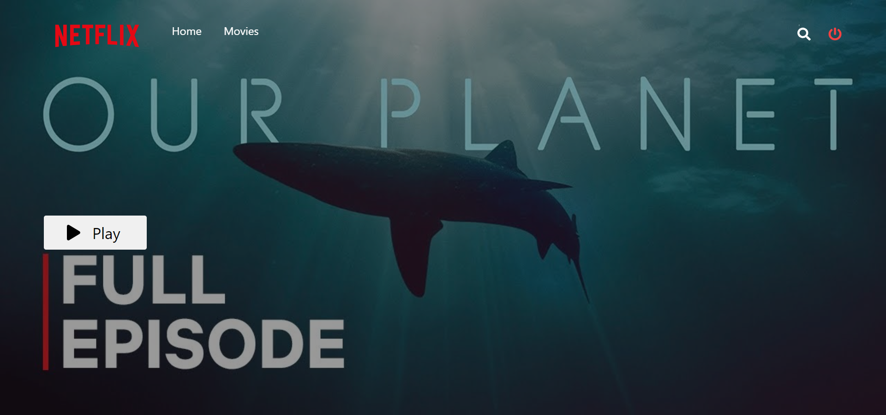
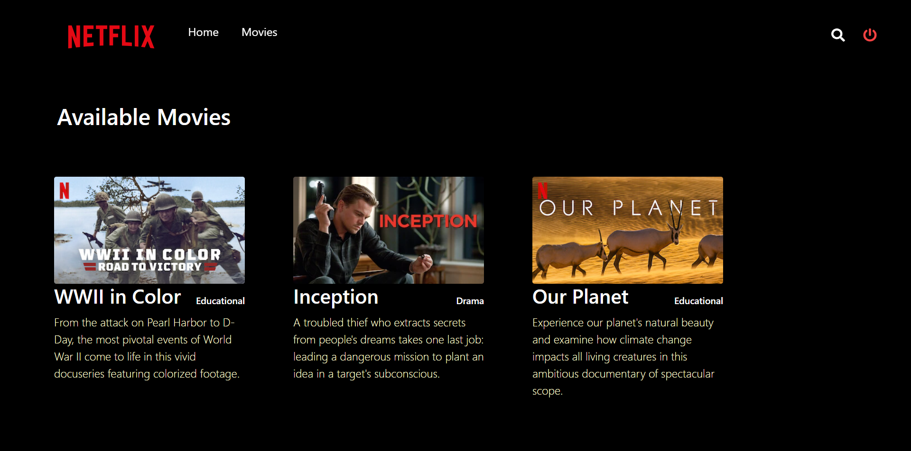
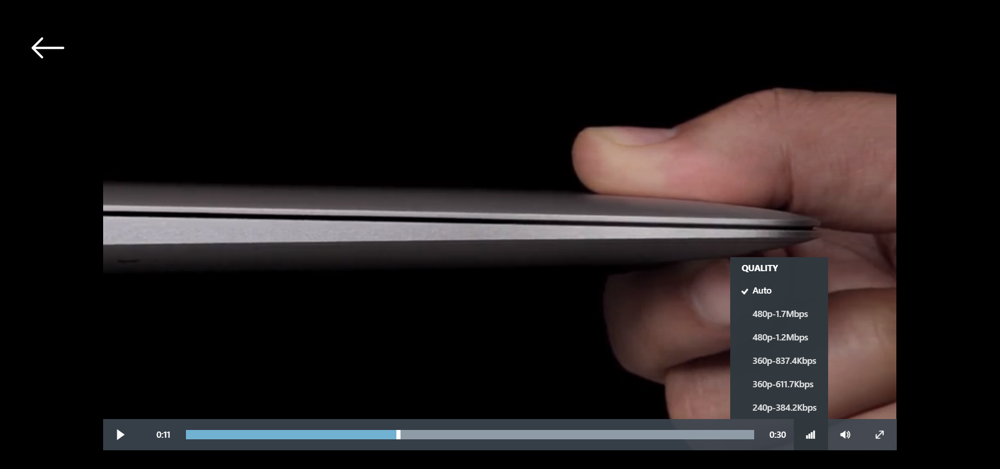

# Netflix Frontend

This repository contains the codebase for the UI of Netflix which uses the api calls defined in the server to stream videos for authenticated users.

## How to run

Frontend hosted link: https://netflick.azurewebsites.net/

1. Clone the repository by `https://github.com/Cldc-Team30/netflix-frontend.git`
2. Before starting the frontend, make sure your backend server is up and running by following the setup instructions [here](https://github.com/Cldc-Team30/netflix-server).
3. Cd into the repository `cd netflix-frontend` and run `npm i` to install all the node packages.
4. Run `npm start` to run the frontend.

## UI Screenshots

**Sign Up Page:**

**Home Page:**

**Movies Page:**

**Media Player:**

